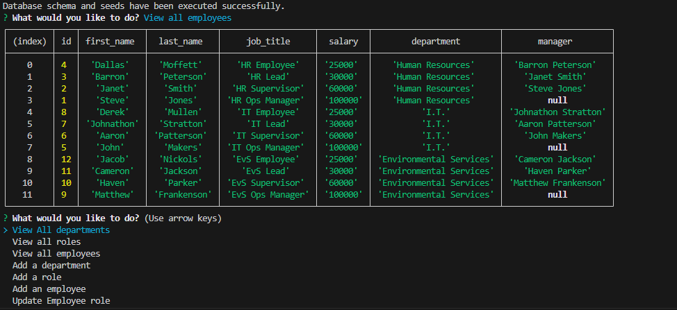

# SQL-Employee-Tracker

  
  ## Table of contents

  [Description](#Description)

  [Installation](#Installation)

  [Usage](#Usage)

  [Contribution](#Contribution)
  
  [Tests](#Tests)

  [License](#License)

  [Questions](#Questions)

  ## Description 

  This program allows you to use a SQL server to keep track of your different departments roles and employees for a business.

  ## Installation 

  After cloning the repo they will need to run npm i to install all the dependency's.

  ## Usage 

  Make sure to spell the employees name correctly when you add them to the server! Also currently if the server is shut down you will lose all of the new things you added.

  ## Contribution 

  No guidelines.

  ## Tests  

  After installing everything make sure to add a .env file with your password for mysql. Afterwards run node index and the program will start.

  ## License 

  [Mit](https://opensource.org/licenses/MIT)

  ## Questions 

  I am on github at [UtuRaiden](https://github.com/UtuRaiden)

  Or my email is barronpeterson56@gmail.com
 
  ## [Walkthrough video](https://drive.google.com/file/d/1-z0krUY1pqF_JScmFZUHvb9VwfnzGycT/view)

  ## Screenshots

  

  ## References  

  In index.js lines 75-78 and lines 84-87 i used chatgbt to help make the sql code run properly. 

  in the querys.js chatgbt helped me to be able to find the corresponding response to the server. I was originally going to use a for loop and loop over every response to find the matching variable but i was having issues with that and chatgbt told me about .find and its syntax and i personally thought it made the code more readable and so i used that. 
